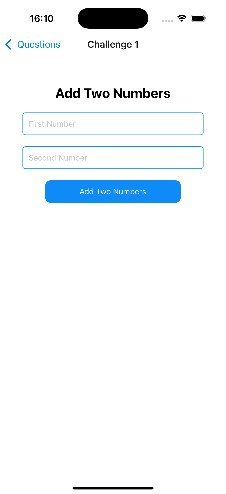
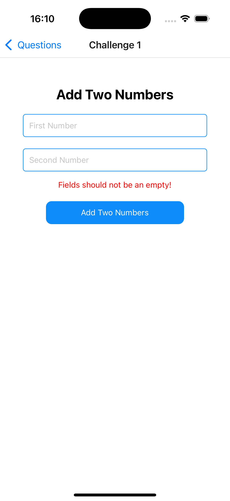
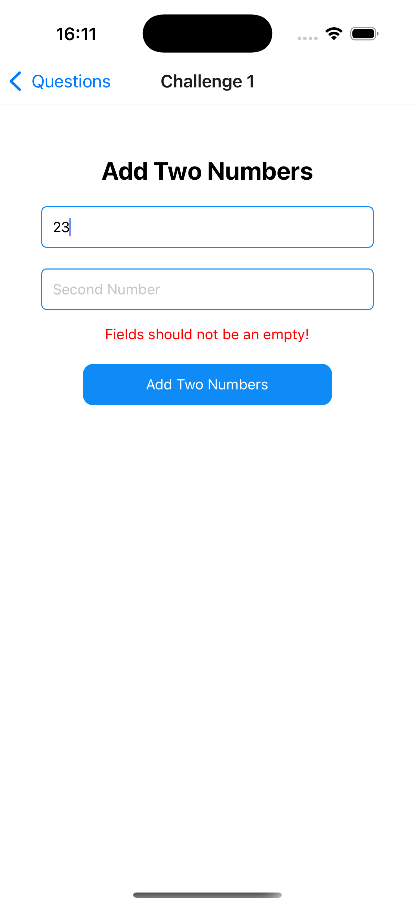
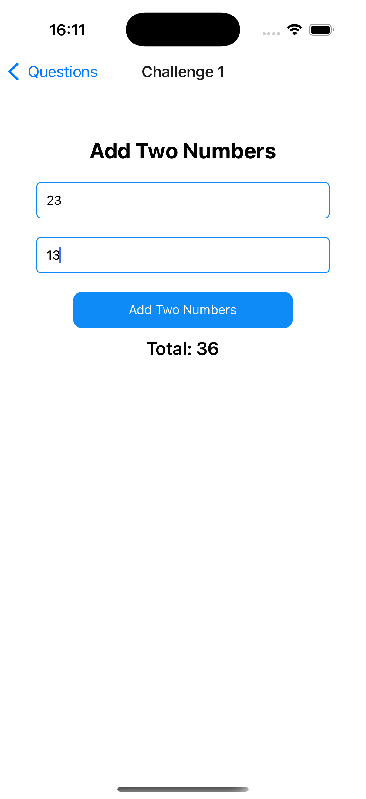
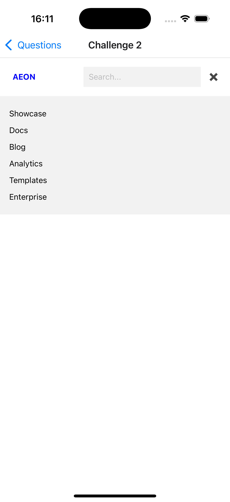
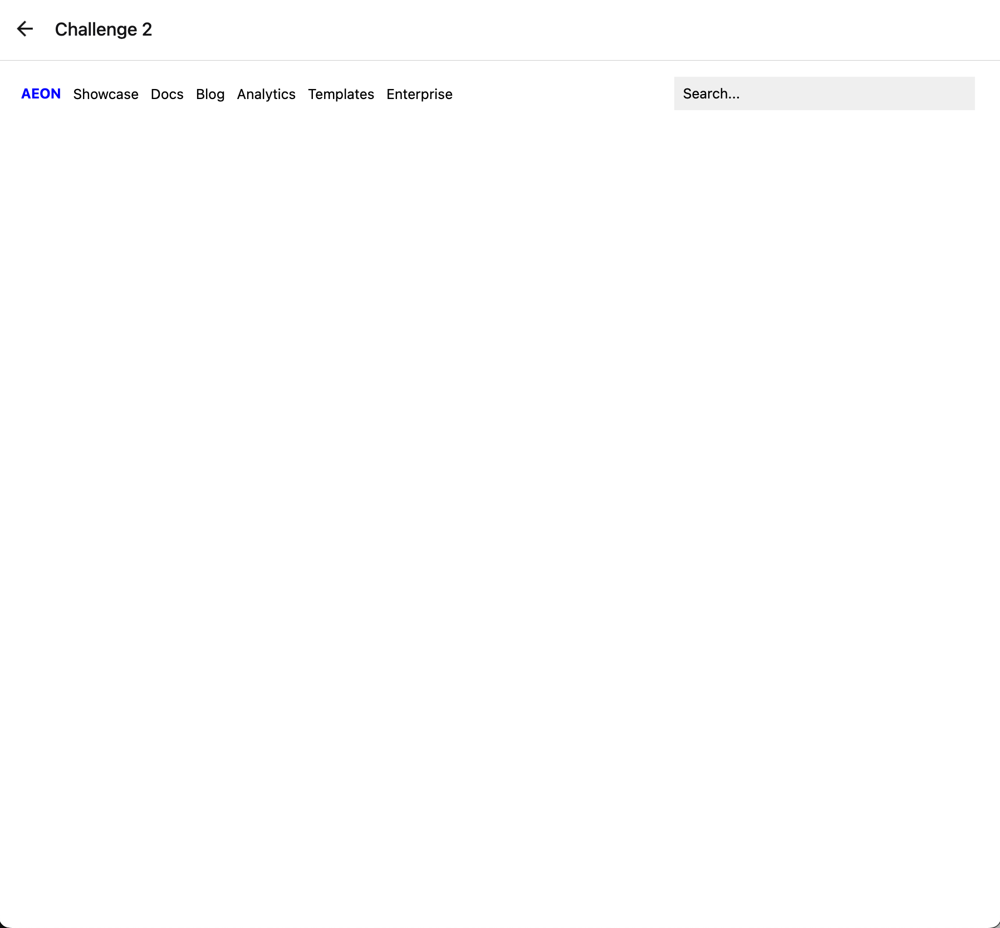
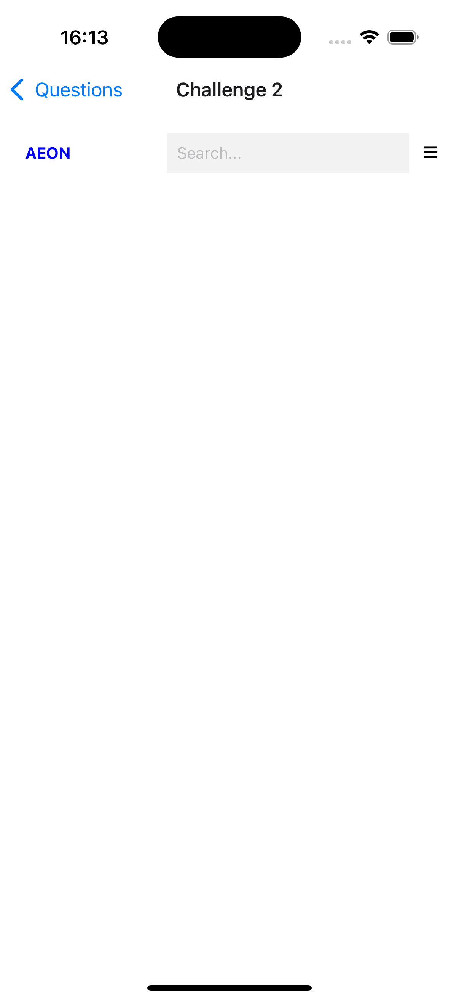
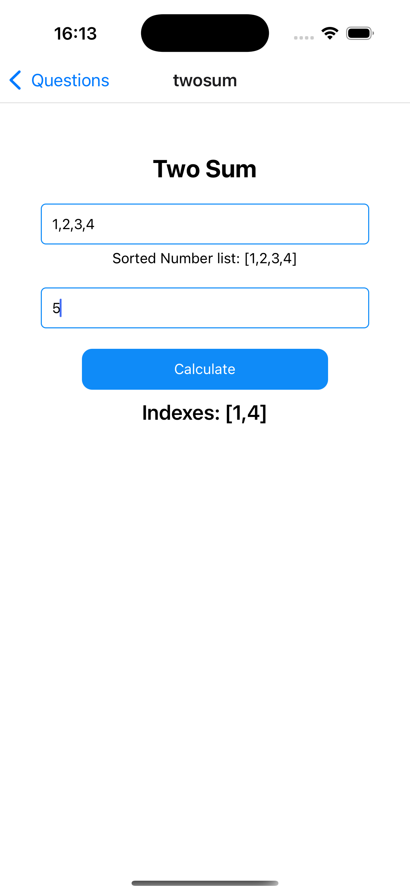
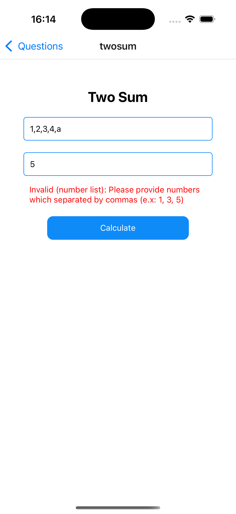
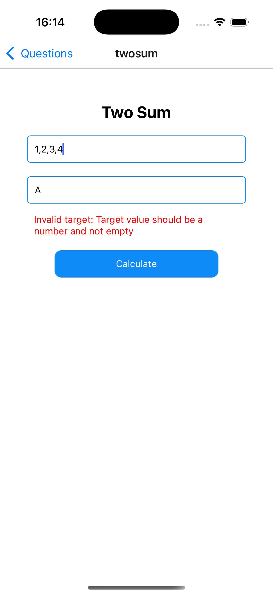

# Welcome to your Expo app 👋

This is an [Expo](https://expo.dev) project created with [`create-expo-app`](https://www.npmjs.com/package/create-expo-app).

## Get started

1. Install dependencies

   ```bash
   npm install
   ```

2. Start the app

   ```bash
   npx expo start
   ```
   or
   ```bash
   npm start
   ```
&nbsp;&nbsp;&nbsp;

Question 1 - Screenshots

<p>
   
   
   
   
</p>

&nbsp;&nbsp;&nbsp;

Question 2 - Screenshots

<p>
   
   
   
</p>

&nbsp;&nbsp;&nbsp;

Question 3 - Screenshots

<p>
   
   
   
   
   
   
</p>
