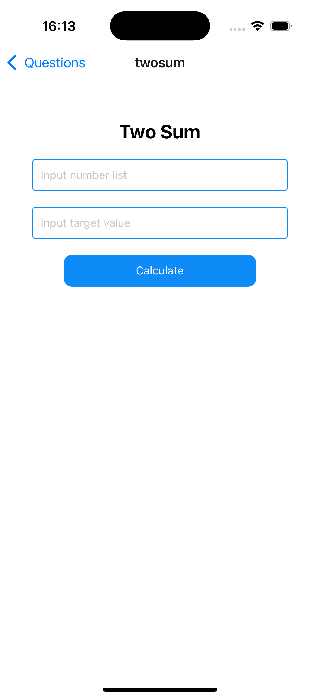

# Ascendion Test

## Get started

For this application, I'm using React Native Expo. Please follow the instructions below to run the project.

1. Install dependencies

   ```bash
   npm install
   ```

2. Start the app

   ```bash
   npx expo start
   ```
   or
   ```bash
   npm start
   ```

After running the above code, you will get the following information in the terminal.


You can follow the above instructions to run the app on iOS, Android, or the Web.

&nbsp;&nbsp;&nbsp;

Question 1 - Screenshots

<p>
   
   
   
   
</p>

&nbsp;&nbsp;&nbsp;

Question 2 - Screenshots

<p>
   
   
   
</p>

&nbsp;&nbsp;&nbsp;

Question 3 - Screenshots

<p>
   
   
   
   
   
   
</p>
